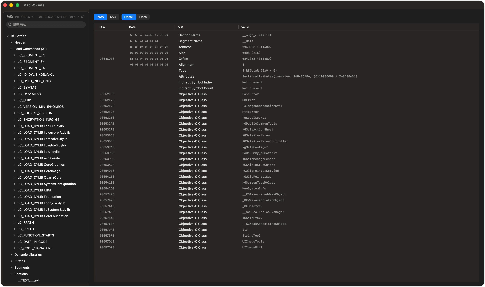
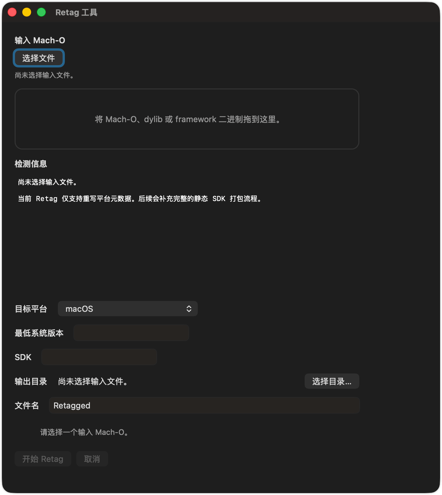
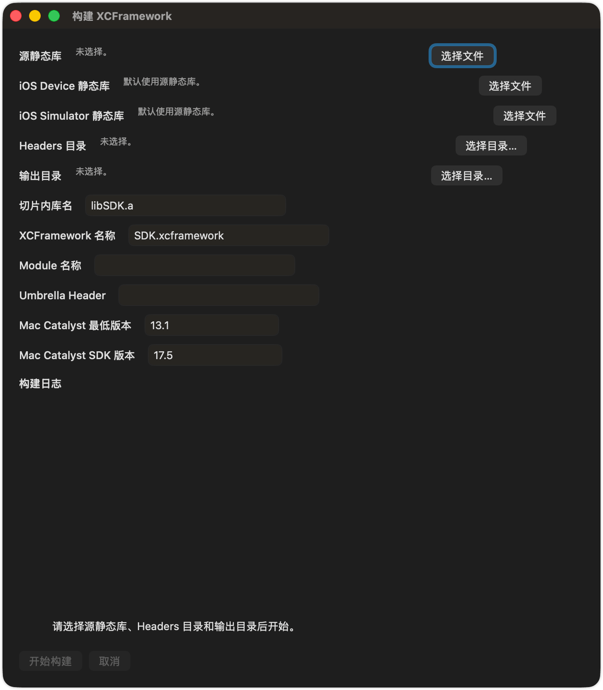
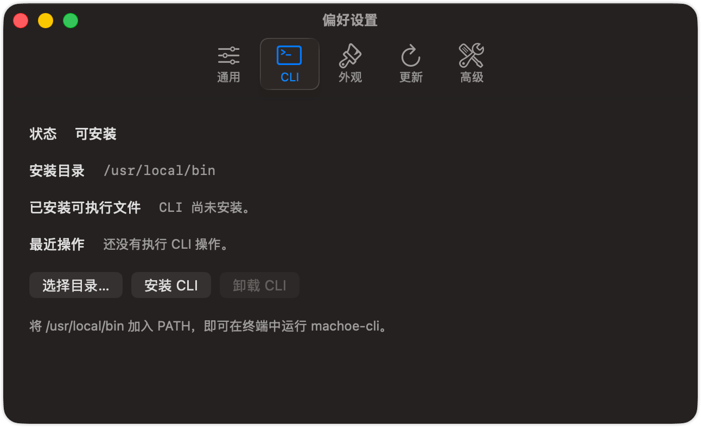

# MachOKnife

MachOKnife is a native macOS Mach-O browser and utility suite with an AppKit GUI, a companion CLI, Sparkle updates, and release tooling for DMG and appcast publishing.

## What It Ships Today

- MachOKit-backed document browser with lazy tree expansion and MachO-Explorer-style grouping
- searchable workspace with RAW/RVA address modes, `Detail` and `Data` panes, and node-level copy/export actions
- inspection support for thin and fat Mach-O binaries, load commands, sections, symbols, string tables, Objective-C metadata, and related grouped summaries
- localized Preferences for General, CLI, Appearance, and Updates, including immediate language refresh and adaptive window sizing
- Tools menu windows for `Retag`, `Build XCFramework`, `Mach-O Summary`, `Check Binary Contamination`, and `Merge / Split Mach-O`
- `machoe-cli` commands for inspection, summary, contamination checks, merge/split, install-name editing, rpath rewriting, retagging, XCFramework packaging, and dyld-cache-style dylib repair
- GRDB-backed recent files with security-scoped bookmark restoration after relaunch
- Sparkle update runtime plus scripted DMG, GitHub Release, and appcast generation

## Screenshots









## Repository Layout

- `Packages/CoreMachO`: low-level parsing and rewrite helpers shared by the app and CLI
- `Packages/MachOKnifeKit`: browser models, document services, and shared inspection logic
- `Packages/MachOKnifeDB`: GRDB-backed persistence primitives
- `MachOKnifeApp`: AppKit application shell, preferences, workspace UI, and tool windows
- `MachOKnifeCLI`: `machoe-cli` sources
- `Resources/Localization`: app localizations
- `Resources/Fixtures`: generated fixtures used by smoke tests
- `Resources/Updates`: Sparkle feed output
- `Scripts`: build, DMG, release, and appcast helpers

## Build And Run

Open `MachOKnife.xcworkspace` in Xcode and run the `MachOKnife` scheme, or build from Terminal:

```bash
xcodebuild build \
  -workspace MachOKnife.xcworkspace \
  -scheme MachOKnife \
  -destination 'platform=macOS,arch=x86_64'
```

## GUI Usage

### Opening Files

- drag a Mach-O, `.dylib`, framework binary, or app binary into the main workspace
- use `File > Open…`
- use `File > Open Recent` to reopen previously authorized files after app relaunch
- use `File > Close File` to return the workspace to the initial empty state with confirmation

### Workspace Browser

- browse the document through a tree structured like MachO-Explorer
- search nodes from the main workspace
- switch the address column between `RAW` and `RVA`
- inspect semantic fields in `Detail` and bytes in `Data`
- right-click any node or row to copy/export the current view
- export the selected node from the File menu or copy it from the Edit menu

### Preferences

- `General`: language and core app behavior
- `CLI`: install or uninstall the bundled `machoe-cli` into a user-selected directory
- `Appearance`: follow system, light, or dark
- `Updates`: manual, daily, and startup check strategies with Sparkle status visibility

### Tools

- `Retag…`: open a dedicated window for platform metadata retagging with drag and drop, target selection, output configuration, progress, and cancellation
- `Build XCFramework…`: package iOS device/simulator/static-library inputs into an XCFramework, with optional automatic Mac Catalyst retagging
- `Mach-O Summary…`: generate a summary report for Mach-O files and archives
- `Check Binary Contamination…`: inspect binaries or archives for platform / architecture contamination
- `Merge / Split Mach-O…`: merge multiple slices into one output or split fat inputs by architecture

## CLI Usage

Build the `machoe-cli` target from Xcode or through the `MachOKnife` scheme, then run:

```bash
machoe-cli info /path/to/binary
machoe-cli summary /path/to/binary
machoe-cli list-dylibs /path/to/binary
machoe-cli check-contamination /path/to/binary --mode architecture --target arm64
machoe-cli merge /path/to/arm64.a /path/to/x86_64.a --output /tmp/Merged.a
machoe-cli split /path/to/FatBinary --output-dir /tmp/SplitOutputs
machoe-cli validate /path/to/binary
machoe-cli set-id /path/to/libExample.dylib --install-name @rpath/libExample.dylib --output /tmp/libExample.dylib
machoe-cli rewrite-rpath /path/to/libExample.dylib --from /old/path --to @loader_path/Frameworks --output /tmp/libExample.dylib
machoe-cli retag-platform /path/to/libExample.dylib --platform macos --min 13.0 --sdk 14.0 --output /tmp/libExample.dylib
machoe-cli build-xcframework --source-library /path/to/libSDK.a --ios-simulator-source-library /path/to/libSDK-sim.a --headers-dir /path/to/Headers --output /tmp/SDK.xcframework
machoe-cli fix-dyld-cache-dylib /path/to/libCacheStyle.dylib --output /tmp/libCacheStyle.fixed.dylib
```

To build local verification fixtures:

```bash
bash Scripts/build_fixtures.sh
machoe-cli info Resources/Fixtures/generated/libFixture.dylib
machoe-cli list-dylibs Resources/Fixtures/generated/libFixture.dylib
```

## Updates

Sparkle is wired through `UpdateManager`. The published feed lives at `Resources/Updates/appcast.xml`, and the app expects valid `SUFeedURL` and `SUPublicEDKey` values in the app configuration for production releases.

## Release Workflow

Build, notarize, publish, and refresh the feed with the included scripts:

```bash
bash Scripts/build_dmg.sh
bash Scripts/generate_appcast.sh --archive build/dmg/MachOKnife_V_1.3.0.dmg
bash Scripts/publish_github_release.sh --dmg build/dmg/MachOKnife_V_1.3.0.dmg
```

- `build_dmg.sh` builds the app, re-signs it for distribution, creates the DMG, and can notarize it
- `generate_appcast.sh` signs Sparkle feed entries and writes `Resources/Updates/appcast.xml`
- `publish_github_release.sh` uploads the DMG to GitHub Releases and refreshes the appcast using the published release notes

## Verification

Build the app and CLI from the workspace:

```bash
xcodebuild build \
  -workspace MachOKnife.xcworkspace \
  -scheme MachOKnife \
  -destination 'platform=macOS,arch=x86_64'

xcodebuild build \
  -workspace MachOKnife.xcworkspace \
  -scheme machoe-cli \
  -destination 'platform=macOS,arch=x86_64'
```

Run package tests for the shared parsing and tooling layers:

```bash
swift test --package-path Packages/CoreMachO
swift test --package-path Packages/MachOKnifeKit
```
