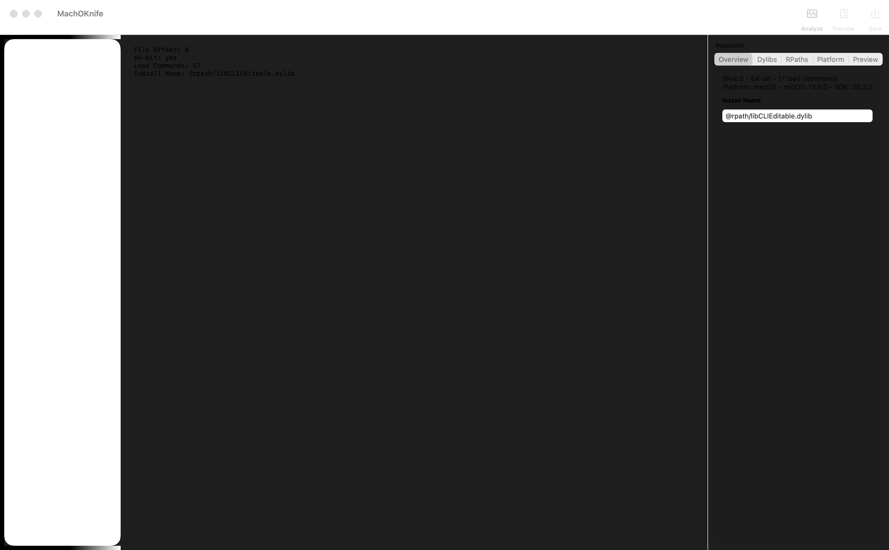
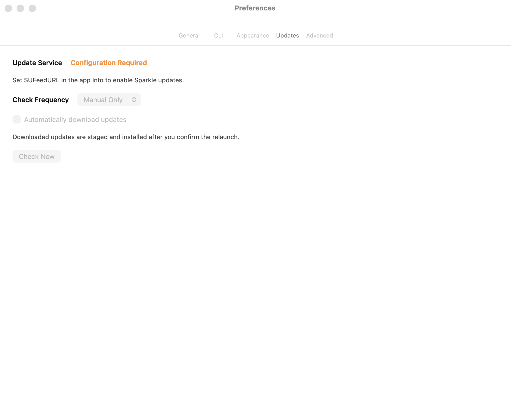

# MachOKnife

MachOKnife is a native macOS Mach-O inspection and metadata surgery tool with an AppKit GUI and a companion CLI.

It currently ships:

- AppKit workspace with drag and drop, file import, analyze, preview, save, and recent-file support
- editable install name, dylib dependency, rpath, and platform/version workflows
- CLI commands for inspection, validation, install-name editing, rpath rewriting, retagging, and dyld-cache-style dylib repair
- localized preferences for language, appearance, CLI installation, updates, and recent-file limits
- Sparkle update runtime wiring and GRDB-backed recent-files persistence

## Screenshots





## Repository Layout

- `Packages/CoreMachO`: low-level Mach-O parsing
- `Packages/MachOKnifeKit`: shared analysis models and services
- `Packages/MachOKnifeDB`: GRDB-backed persistence primitives
- `MachOKnifeApp`: AppKit application shell
- `MachOKnifeCLI`: `machoe-cli` sources
- `Resources/Localization`: app localizations
- `Resources/Fixtures`: generated milestone fixtures
- `Scripts`: repeatable verification helpers

## Build And Run

Open `MachOKnife.xcodeproj` in Xcode and run the `MachOKnife` scheme, or build from Terminal:

```bash
xcodebuild build \
  -project MachOKnife.xcodeproj \
  -scheme MachOKnife \
  -destination 'platform=macOS,arch=x86_64'
```

## GUI Usage

- dragging a Mach-O, `.dylib`, framework binary, or app binary into the workspace
- `Open...` from the File menu
- `Analyze` to re-run parsing on the current file
- `Preview` and `Save` for metadata changes with diff-oriented feedback
- localized Preferences tabs for General, CLI, Appearance, Updates, and Advanced
- CLI install/uninstall controls and recent-file limit configuration
- Sparkle-backed manual update check entry point from the app menu

## CLI Usage

Build the `machoe-cli` target from Xcode or through the `MachOKnife` scheme, then run:

```bash
machoe-cli info /path/to/binary
machoe-cli list-dylibs /path/to/binary
machoe-cli validate /path/to/binary
machoe-cli set-id /path/to/libExample.dylib --install-name @rpath/libExample.dylib --output /tmp/libExample.dylib
machoe-cli rewrite-rpath /path/to/libExample.dylib --from /old/path --to @loader_path/Frameworks --output /tmp/libExample.dylib
machoe-cli retag-platform /path/to/libExample.dylib --platform macos --min 13.0 --sdk 14.0 --output /tmp/libExample.dylib
machoe-cli fix-dyld-cache-dylib /path/to/libCacheStyle.dylib --output /tmp/libCacheStyle.fixed.dylib
```

To build a local verification fixture:

```bash
bash Scripts/build_fixtures.sh
machoe-cli info Resources/Fixtures/generated/libFixture.dylib
machoe-cli list-dylibs Resources/Fixtures/generated/libFixture.dylib
```

To refresh README screenshots:

```bash
bash Scripts/capture_readme_screenshots.sh
```

## Updates

Sparkle is wired into the app through `UpdateManager`. The repository includes a placeholder feed at `Resources/Updates/appcast.xml`; replace it with the published appcast and a real `SUPublicEDKey` before shipping a production build.

## Release

The repository now includes a scriptable release path:

```bash
bash Scripts/build_dmg.sh --no-notarize
bash Scripts/generate_appcast.sh --archive build/dmg/MachOKnife_V_1.0.dmg
bash Scripts/publish_github_release.sh --dmg build/dmg/MachOKnife_V_1.0.dmg --draft
```

`build_dmg.sh` builds and re-signs the app, creates a polished DMG, and can optionally notarize it.
`generate_appcast.sh` signs Sparkle feed entries with your Sparkle key account and writes the feed to `Resources/Updates/appcast.xml`.
`publish_github_release.sh` uploads the DMG to GitHub Releases and refreshes the appcast using the published release notes.

## Verification

Run the current verification pipeline:

```bash
bash Scripts/test_milestone_1.sh
```

For release assets, also run:

```bash
bash Scripts/capture_readme_screenshots.sh
```
